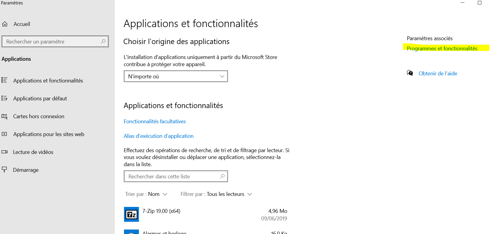

## Docker :

* S'assurer que la virtualisation est activée sur son ordinateur. Pour cela, il faut aller dans le bios.

**Pour Debian :**

* https://docs.docker.com/install/linux/docker-ce/debian/

Installer docker-compose :

* https://docs.docker.com/compose/install/

**Pour Windows famille :**

* https://github.com/docker/toolbox/releases/download/v19.03.1/DockerToolbox-19.03.1.exe

**Pour Windows Pro/Entreprise :**

1. 
2. 
3. 
4. 
5. https://www.docker.com/

## Visual Studio Code :

1. https://code.visualstudio.com/
2. Une fois Visual Studio code installé : https://marketplace.visualstudio.com/items?itemName=MS-vsliveshare.vsliveshare-pack